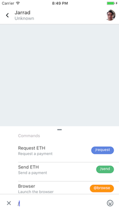
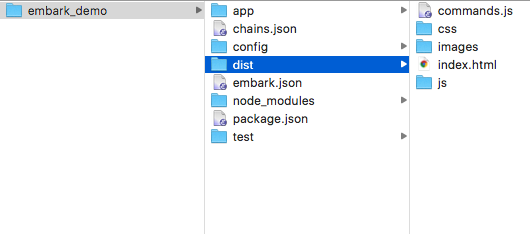
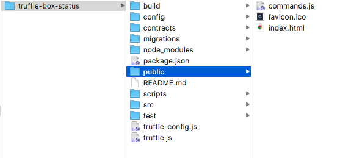
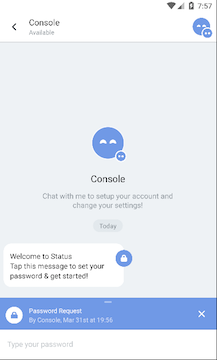
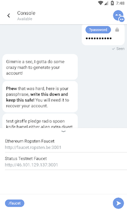

## Giving Your DApp Commands on Status: Introduction to the Status Chat API

*(warning: the Chat API is still a work in progress. Come ask in the Slack if you hit bumps!)*

## Introduction

One of the first things you’ll notice when you start using Status is that you can send and receive funds just by issuing simple commands.

  
*Easily send or request eth*

This is no accident! Today, more people use smartphones than computers, and when people are on their smartphones, they spend a lot of their time in messaging applications. Smartphone users enjoy using messaging to control applications, because it’s simple and convenient.

Status allows users to interact with a wide array of DApps using the same intuitive chat interface. In the near future, Status users will be able to have group chats where most of the participants are DApp chatbots. All DApp developers will benefit from this synergy, because a common chat interface for multiple DApps makes using your DApp more convenient, and effectively makes your DApp more powerful.

In this guide, we’ll explore how you can use the Status Chat API while developing your DApp on Status to create custom commands for your users. As a result of developing on Status, you’ll have a DApp that your users can access on MetaMask, Mist, and Status — and that invites mobile users with native mobile commands. With little extra developer time invested, you’ll gain a mobile app.

If you haven’t already, you can [join our Slack](https://slack.status.im), and download the [Android binary](https://test.status.im). We’d love to chat with you as you get started.

## Delivering Your Commands to Status

The majority of this tutorial covers the Status Chat API. First, though, let’s touch on how you’ll make your commands available after you’ve written them using the API.

To add a command to your DApp in Status, you’ll write your commands in JavaScript, put them in a file named `commands.js`, and make the file publicly available at `https://yourAwesomeDApp.com/commands.js`. When your DApp goes live and is added to Status, Status will take the file from that URL and create your commands.

If you decide to use the Truffle or Embark DApp development frameworks, they have standard locations which will put your commands.js file at the right URL. For Truffle, that’s the folder `public`, and for Embark, that’s the folder dist. So in Truffle, you’ll have `public/commands.js`, and in Embark, you’ll have `dist/commands.js`.

  
*commands.js locations on a Mac: Embark on the left, Truffle on the right*

The file itself will be the same whether you develop with Truffle, with Embark, or a different framework or no framework. You just need to place the file at the right location to make it available during development and after your DApp goes live.

During development, this location will be part of your local computer file system. If you’re developing with `truffle-box-status` or the `embark-status` plugin, you’ll be able to see your DApp on Status at `localhost:8080/commands.js` (for example), and Status will create your commands the same way. After you’ve finished development, you’ll need to host your DApp in the traditional way or in a decentralized way such as Swarm to make the whole thing publicly available.

Your users can see possible commands in one of two ways. If they’re chatting directly with your DApp, they can type a forward slash, “/”, and that will bring up a list of suggestions. Or they can click the bullet point icon to the left of the chat input box. If you haven’t defined any commands, clicking the bullet point list icon will just fill in the command `/browse`, which is a globally available Status command.

Your users will be able to access your DApp’s commands in a group chat as well, as long as your DApp has been added to the chat. In that case, your commands will show as `/yourAwesomeDApp/your-command`.

## The Status Commands

You can take advantage of three methods: `status.command()`, `status.response()`, and `status.on()`. These methods (along with a few methods used only by Status) are defined in the [Status GitHub repo](https://github.com/status-im/status-react/blob/develop/resources/status.js) at `resources/status.js`, in the `status` var.

Let’s walk through each, and the parameters each command takes. We’ll also build a toy `hello` example as we go. For easy reference, you’ll find the code for that example, as well as a summary of the methods and parameters, at the end of this article.

### status.command()

We’ll start with the the most important method available to you, the one that you’ll use for your DApp’s unique commands. You’re allowed to pass up to 12 parameters into `status.command()`.

1. `name`. This is what your users will type in following a forward slash to invoke the command. For instance, if you wrote `name: “hello”`, your user might invoke `/hello`.
2. `title`. Remember that when your user starts typing a command, a list of suggestions appears. In the list of suggestions, the title appears on the left, above the description.
3. `description`. Similarly, in the list of suggestions, the description appears on the left, below the title.
4. `color`. This parameter defines the background color of the name of your command as it appears in the list of suggestions. Give commands different colors to help your users easily distinguish commands, and to harmonize with your DApp’s brand and color scheme.

You can see that these first four parameters control how your command will appear to your users in the list of suggestions. In addition, the `name` parameter gives your users a way to invoke your command. Here’s an example of the first four parameters defining a `/hello` command:

    status.command({
     name: “hello”,
     title: “HelloBot”,
     description: “Helps you say hello”,
     color: “#7099e6”,
    });

5. `preview`. This option defines what your user will see as a result of *their* action, before any other response. The `preview` parameter takes a function, which should return a `status.component`.

For instance, if you use the command `/location`, from the Mailman DApp on Status, you’ll see a preview of a geographic location. This command is intended to send the user’s location to someone else, and so it doesn’t depend on the recipient’s response.

To continue with our `hello` example, you could add to the parameters you’ve already written above:

    preview: function () {
     return status.components.text({}, “you’re saying hello”);
     },

We’ll discuss the `status.components` — there are only seven! — in the next section, after covering the other parameters to `status.command`.

6. `short-preview`. While `preview` controls how your command appears within your DApp’s chat, the `short-preview` parameter controls how your commands get shown in the list of chats, before your users tap on your chat.

7. `icon`. Suppose your user is interacting with your command. Each command can have a custom icon to appear in the command preview. For instance, if you request ETH from someone, a green two-way arrow appears in the preview. Or you can look again at the result of the `/location` command in the picture above. Next to `/location`, and above the map, there’s a small pin icon. Both are examples of command icons, another way to improve your design for your users.

8. params. This important option is where you define possible inputs to your command. It requires an array holding an object, with possible parameters `name`, `placeholder`, `suggestions`, and one of the `status.types`.

Here’s a simple example, which you might add to your `/hello` command:

    params: [{
     name: “hello”,
     type: status.types.TEXT
     placeholder: "Why not say hello"
    }],

These `params` are available in any parameter, including in `params` itself. For instance, if your users sends `/hello whatsup`, the input `whatsup` will be available in your command under `params.hello`.

Naturally, the `type` dictates what sort of data your users may input. The available Status types are: `status.types.TEXT`, `status.types.NUMBER`, `status.types.PHONE`, and `status.types.PASSWORD`.

  
*Notice the placeholder “Type your password”*

The `placeholder` parameter here only applies if your users haven’t put any input into the command, not even the name of the command. You can use it to include helpful guidance where necessary. This parameter will probably prove useful if you end up using `status.response()`, one of the other methods available to you, which we’ll cover in another section.

  
*After you enter /faucet, two suggestions pop up.*

As another parameter inside `params`, you can also include `suggestions` for your users’ input. This should return a component to be rendered.

For instance, if you are using the Console DApp and you select the `/faucet` command, you’ll see two suggestions to choose from.

Let’s add this idea to our `hello` example:

    params: [{
     name: “hello”,
     type: status.types.TEXT
     suggestions: helloSuggestions
    }],

That’s simple, but what’s `helloSuggestions`? Let’s make a function, which will return a `scrollView` that will hold two suggestions: “Hello”, and “Goodbye”. Don’t get intimidated by the length, there’s actually not much to it.

    *// Three little helpers - don't worry about them, they're just for
    // style.*

    function suggestionsContainerStyle(suggestionsCount) {
        return {
            marginVertical: 1,
            marginHorizontal: 0,
            keyboardShouldPersistTaps: true,
            height: Math.min(150, (56 * suggestionsCount)),
            backgroundColor: "white",
            borderRadius: 5,
            flexGrow: 1
        };
    }
    var suggestionSubContainerStyle = {
        height: 56,
        borderBottomWidth: 1,
        borderBottomColor: "#0000001f"
    };

    var valueStyle = {
        marginTop: 9,
        fontSize: 14,
        fontFamily: "font",
        color: "#000000de"
    };

    *// The main star of our show! It will return two touchable buttons.*

    function helloSuggestions() {
        var suggestions = ["Hello", "Goodbye"].map(function(entry) {
            return status.components.touchable(
                {onPress: [status.events.SET_VALUE, entry]},
                status.components.view(
                    suggestionContainerStyle,
                    [status.components.view(
                        suggestionSubContainerStyle,
                        [
                            status.components.text(
                                {style: valueStyle},
                                entry
                            )
                        ]
                    )]
                )
            );
        });

    *// Let's wrap those two touchable buttons in a scrollView*
    var view = status.components.scrollView(
            suggestionsContainerStyle(2),
            suggestions
        );

    *// Give back the whole thing inside an object.*
    return {markup: view};
    }

The main point of this example is that your `suggestions` parameter should accept users’ input, and then return a component to be rendered.

9. `suggestionsTrigger`. Now that we’ve covered `params` and the possibility of `suggestions`, it’s easy to see that `suggestionsTrigger` will take a string corresponding to an event which triggers showing suggestions. If you don’t include this parameter, the default is `"on-change"`, so your suggestions will show when your users select the command.

10. `fullscreen`. If your command has suggestions, this param controls whether that list of suggestions expands to fill the entire screen. If your command has a lot of suggestions, you might want set `fullscreen` to true, so that your users don’t have to pull the list upwards. On the other hand, if your command has only a few suggestions and you set `fullscreen` to true, your users will have to pull the list downwards to keep it from hiding the screen. Choose whichever will be most convenient to your users, considering your command’s suggestions.

  
*/send’s validator function says “la la la” is not a valid amount of ETH!*

11. `validator`. This parameter allows you to check your users’ input before sending off the command. It takes a function, which should return an error if the input is invalid.

You can easily see an example if you try to send an amount of ETH that’s not a number! To continue with our `/hello` example, you might write something like:

    validator: function(params) {
     if (!params.hello) {
       return status.components.text({}, “Say hello”);
       }
     }

This will raise an error if your user doesn’t input a string. Notice that you should return your message inside one of the `status.components`.

12. `handler`. Of course, you probably want the command to do something when your users call it! The `handler` parameter takes a function to accomplish this. For instance, suppose your user inputs `/hello howdy`. “Howdy” is a valid string, and will pass the `hello` validator. From there, your `handler` could take over to send this greeting to another user:

    handler: web3.shh.post(params.hello),

If you don’t provide a `handler`, your user will issue the command and then see the `preview`, but nothing else will happen.

### The Status Components

There aren’t many of these components, and you’ll feel very comfortable with them if you’re at all familiar with React. The [`scrollView`](https://facebook.github.io/react-native/docs/scrollview.html), [`webView`](https://facebook.github.io/react-native/docs/webview.html), [`text`](https://facebook.github.io/react-native/docs/text.html), [`image`](https://facebook.github.io/react-native/docs/image.html), [`view`](https://facebook.github.io/react-native/docs/view.html), and [`touchable`](https://facebook.github.io/react-native/docs/touchablehighlight.html) take standard React props (each of those underlined words is linked). `validationMessage` is a custom Status component that just takes two strings, and will return them wrapped in text components inside a `view`. Here’s a list, taken straight from the Status code:

    components: {
     view: view,
     text: text,
     image: image,
     touchable: touchable,
     scrollView: scrollView,
     webView: webView,
     validationMessage: validationMessage
     }

### status.response()

Now that you’ve covered all the parameters for `status.command()`, you can easily understand `status.response()`. This method takes the same parameters that `status.command()` does. The difference is that with this method you can actively ask a user to issue a command.

For example, the Status DApp Wallet allows you to `/request` money. In that case, the person you’re requesting money from will see the result of `status.response(send)` — they’ll be asked to give a command, `/send`, in response to your `/request` command.

The Wallet example illustrates that as a DApp developer, you may wish to use `status.command()` and `status.response()` together to create dialogues of commands. You could also use `status.response()` by itself to prompt your users to enter necessary information as part of the onboarding process for your DApp.

Because `status.command()` and `status.response()` take the same parameters, you can sometimes use nearly the same code for both of them. You simply have to consider when you want to ask a user to issue a command, and when you want to just make the command available. Most of the time, you’ll use `status.command()`.

To return to our `hello` example, if we used all the same code inside our method but used `status.response()`, a user would be asked to respond to another user’s greeting. Hello back!

### status.on()

The method `status.on()` allows your DApp to respond to events. This method requires an event name as a string, and a callback function. For instance, you might define:

    status.on(“init”, function(params, context) {
     status.sendMessage(“Hello, man!”);
    });

With the `"init"` option, your DApp will trigger `status.sendMessage()` when the Status app loads your DApp — your DApp will greet your users even before they have clicked on it. Other options include `“text-change”` and `“message”`.

## That’s All For Now, Folks

Please join other DApp developers in [our Slack](https://slack.status.im) in the #dapp-chat or #dev-status channels.

Finally, here’s the TL;DR of what we’ve covered.

### status.command()

1. `name`:string

1.  `title`:string

1. `description`:string

1. `color`:string, containing valid hex color.

1. `preview`:function

1. `icon`:string

1. `params`:array holding object with parameters `name`, `type`, `placeholder`, and `suggestions`.

1. `suggestionsTrigger`

1. `fullscreen`:boolean. If not included, default is `false`.

1. `validator`:function

1. `handler`:function

1. `short-preview`

Example `commands.js` file to create `hello` command:

    status.command({
     name: “hello”,
     title: “HelloBot”,
     description: “Helps you say hello”,
     color: “#7099e6”,
     preview: function () {
       return status.components.text({}, “you’re saying hello”);
       },
     params: [{
       name: “hello”,
       type: status.types.TEXT
       suggestions: helloSuggestions
        }],
      suggestionsTrigger: 'on-change',
      fullscreen: false,
      validator: function(params) {
        if (!params.hello) {
          return status.components.text({}, “Say hello”);
          }
         },
      handler: web3.post.shh (params.hello)

    });

### Status Components

Standard React Native components, except for `validationMessage`, which just wraps standard components.

    components: {
     view: view,
     text: text,
     image: image,
     touchable: touchable,
     scrollView: scrollView,
     webView: webView,
     validationMessage: validationMessage
     }

### status.response()

Takes all the same parameters as `status.command()`. Use `status.response()` to ask a user to issue a command, whether in response to another command, or as part of your DApp setup.

### status.on()

Requires an event name as a string, and a callback function.
